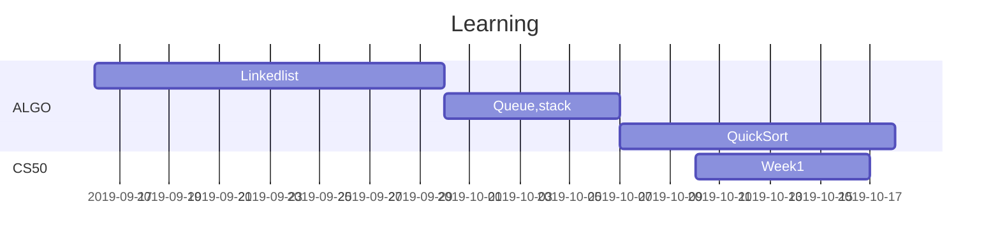

# Algorithm_HW

### Hi!My name is Ginger.Nice to meet you.:rabbit: 

## Weekly HW
- Week3(9/23)
    - Linkedlist
    - Codesignal
- Week4(9/30)
    - Stack
    - Queue
- Week5(10/7)
    - Sort(insertion and quick)

## What will be in here?
- Weekly Hw
- 演算法筆記
- CS50筆記
- Git使用筆記

Learning Timeline
---

